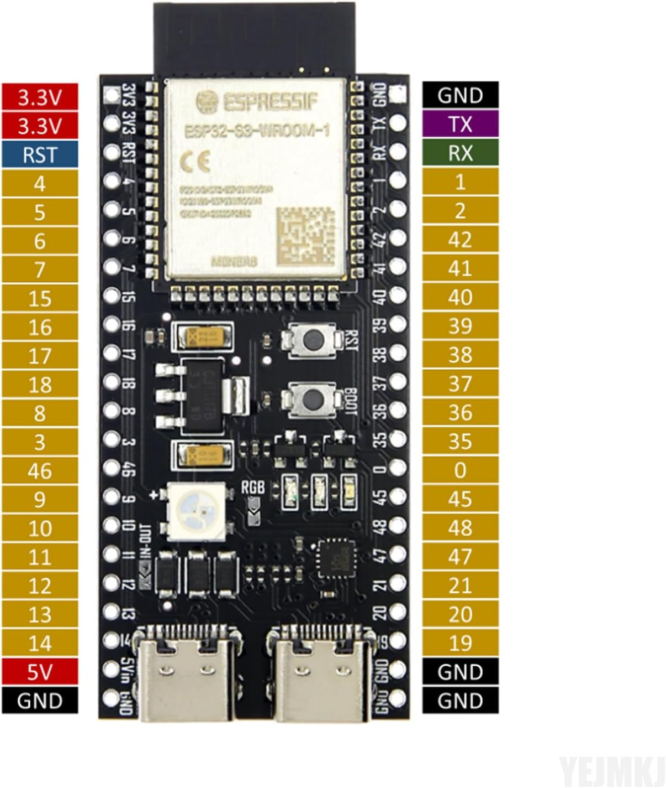
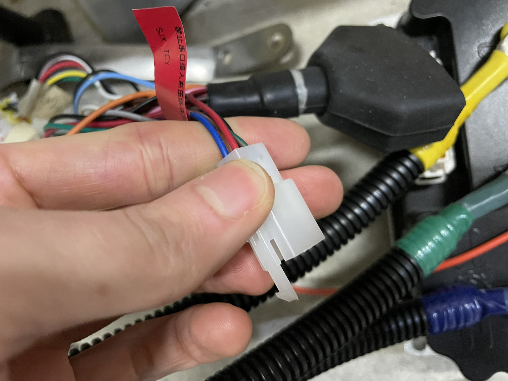
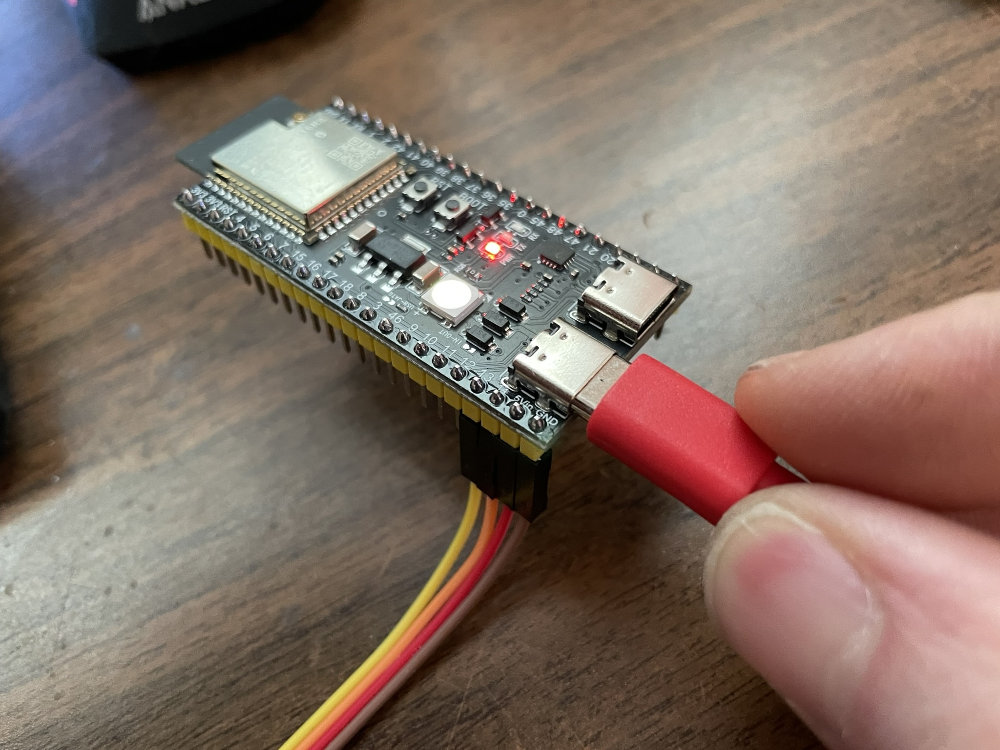
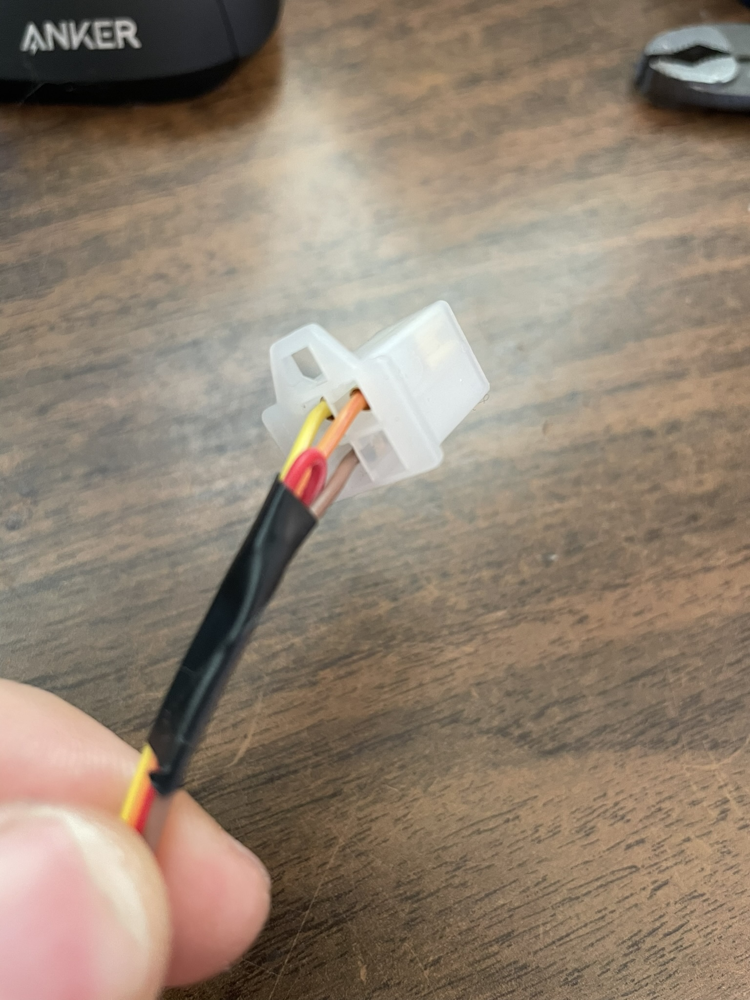

# Fardriver Controller Serial Example

## Requirements

1. [VSCode](https://code.visualstudio.com/)
2. [PlatformIO](https://platformio.org/platformio-ide)

## Hardware

* [ESP32 S3 Dev board](https://www.amazon.com/gp/product/B0CRRMPP3C)

### Fardriver Serial Pin-out

Name           | Pin # | Wire Color   | Description
---|---|---|---|
BW5V           |  2    | Brown/Green  | Serial power (5V)
GND            | 13    | Black        | Reverse/Serial GND
TXD            | 12    | Brown/Blue   | Serial TX (3.3V)
RXD            | 23    | Red/Black    | Serial RX (3.3V)

### ESP32 side

### Adapter cable

Fardriver | ESP32 | Notes
---|---|---
BW5V | 5V | **Only connect when USB port is unplugged**\*
GND | GND |
TXD | 13 |
RXD | 14 |

*Leave BW5V <-> 5V disconnected for now (mine is tapped with electrical tape so nothing is shorted)

## Testing

If successful, you should get output similar to this:

    (Re)opening Fardriver connection
    MosTemp: 11
    motor_temp: 9
    MosTemp: 11
    motor_temp: 9
    MosTemp: 11
    motor_temp: 9
    MosTemp: 11
    motor_temp: 9
    MosTemp: 11
    motor_temp: 9
    (Re)opening Fardriver connection
    MosTemp: 11
    motor_temp: 9
    MosTemp: 11
    motor_temp: 9
    MosTemp: 11
    motor_temp: 9
    MosTemp: 11
    motor_temp: 9